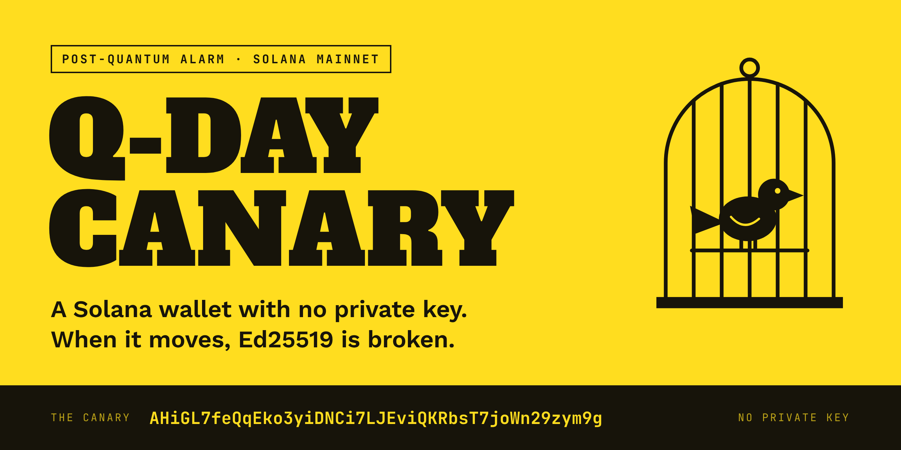
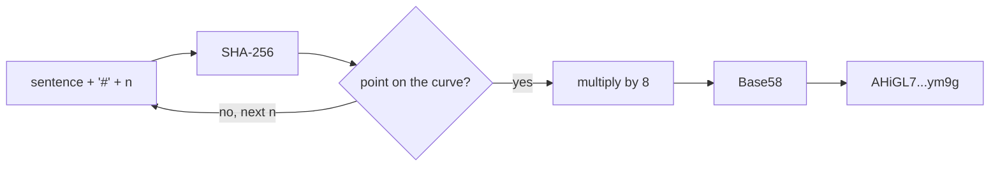
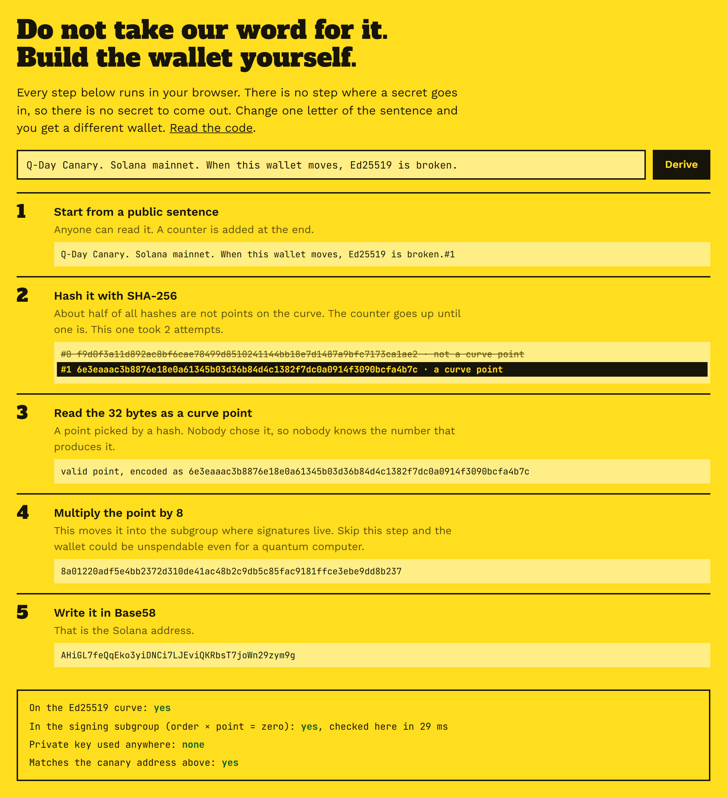
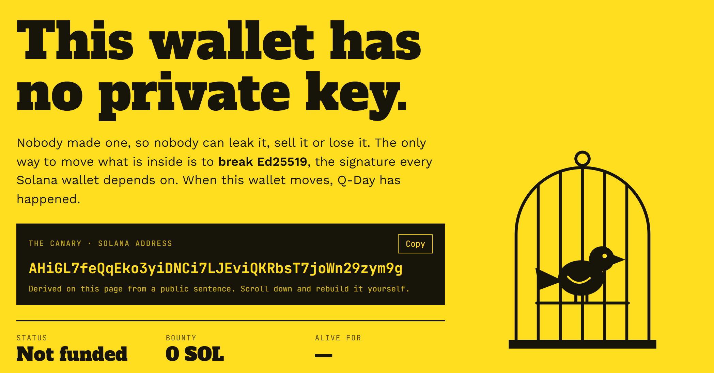
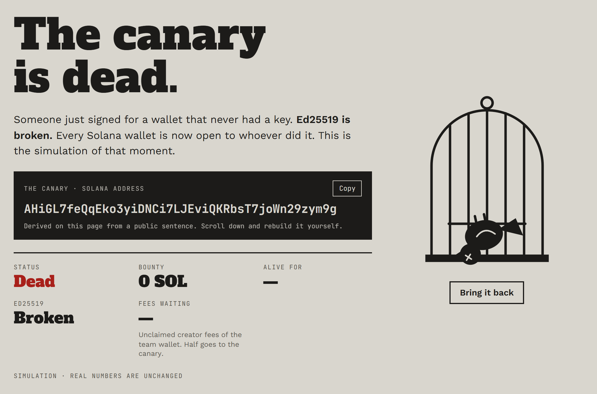
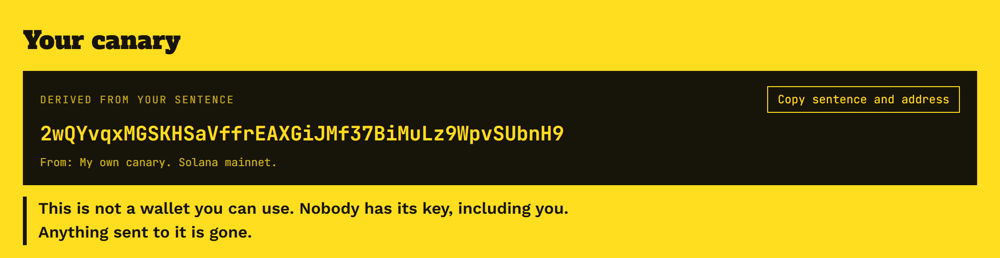

<p align="center"></p>

<p align="center">
  <a href="https://github.com/xyzappdev/QdayCanary/actions/workflows/verify.yml"></a>
  <a href="LICENSE"></a>
  <a href="https://x.com/QdayCanary"></a>
</p>

# Q-Day Canary

**A Solana wallet with no private key. The only way to move it is to break Ed25519.**

| | |
|---|---|
| Canary | [`AHiGL7feQqEko3yiDNCi7LJEviQKRbsT7joWn29zym9g`](https://solscan.io/account/AHiGL7feQqEko3yiDNCi7LJEviQKRbsT7joWn29zym9g) |
| Sentence | `Q-Day Canary. Solana mainnet. When this wallet moves, Ed25519 is broken.` |
| Today | Ed25519 is safe. This is the alarm for the day it is not. |

## Verify it in 30 seconds

You need Node.js 18 or newer. No install step, no dependencies.

```bash
git clone https://github.com/xyzappdev/QdayCanary
cd QdayCanary
node verify.mjs
```

Expected output:

```text
sentence  Q-Day Canary. Solana mainnet. When this wallet moves, Ed25519 is broken.
n         1
sha256    6e3eaaac3b8876e18e0a61345b03d36b84d4c1382f7dc0a0914f3090bcfa4b7c
8 x point 8a01220adf5e4bb2372d310de41ac48b2c9db5c85fac9181ffce3ebe9dd8b237
address   AHiGL7feQqEko3yiDNCi7LJEviQKRbsT7joWn29zym9g
MATCH     AHiGL7feQqEko3yiDNCi7LJEviQKRbsT7joWn29zym9g
```

`MATCH` means the address was rebuilt from the sentence on your machine. If it ever prints `MISMATCH`, the script exits with code 1.

## How the address is made



1. Append `#` and a counter `n` to the sentence, starting with `n = 0`, and hash the result with SHA-256.
2. Read the 32 bytes of the hash as a compressed Ed25519 point. About half of all hashes are not points on the curve; then `n` goes up by one and the hash is tried again. For the canary the first point appears at `n = 1`.
3. Multiply the point by 8. This moves it into the prime order subgroup where signatures live.
4. Write the 32 bytes of the result in Base58. That is the Solana address.

The website runs these steps in your browser with [lib/ed25519.ts](lib/ed25519.ts). [verify.mjs](verify.mjs) runs the same steps on its own, with nothing but `node:crypto` and BigInt. A test checks that both give the same result for the canary and for random sentences.

<p align="center"></p>

## Why nobody holds the key

To hold the key we would need a number k such that k times the base point equals this point. Recovering k from a point is the exact problem that Shor's algorithm solves on a quantum computer. Picking a sentence that lands on a point with a known k would mean breaking SHA-256.

## What the site watches

The site reads the canary from Solana mainnet. The canary counts as dead when it signed a finalized transaction or its balance went down. Either one needs its key. A transaction that only mentions the address does not count. The rule is in [lib/canary/classify.ts](lib/canary/classify.ts).

|  |  |
|---|---|
| Live status | Simulation of Q-Day. Nothing has happened. |

## Make your own canary

Type any sentence on the website, or run:

```bash
node verify.mjs "My own canary. Solana mainnet."
```

<p align="center"></p>

> **Warning.** Nobody holds the key to an address made this way, including you. Anything sent to it is gone.

## What this repository proves

* The canary address comes from the public sentence through an open procedure that anyone can run again.
* The site code in this repository watches exactly that address. It is fixed in [lib/constants.ts](lib/constants.ts), and the page rebuilds it in your browser and shows an error if the two differ.
* The rule for death: the canary signed a finalized transaction or its balance went down. See [lib/canary/classify.ts](lib/canary/classify.ts).

## What it does not prove

That creator fees reach the canary. That is a promise kept by hand. You can check it by looking at the transfers into the canary on chain.

## The coin

No coin has been launched yet. When it is, the contract address will be announced only by @QdayCanary on X. Anything else is not ours. Creator fees will go to a team wallet, which is a normal wallet with a private key. The team sends half of them on to the canary by hand. The coin does not protect any wallet.

## Run locally

```bash
npm install
cp .env.example .env.local
npm run dev
```

Then open http://localhost:3000.

| Variable | Needed | What it does |
|---|---|---|
| `TOKEN_TICKER` | always | The coin's ticker. |
| `TEAM_WALLET` | on production | The team wallet. Without it the site hides the team marks and shows a dash for unclaimed fees. |
| `SOLANA_RPC_URL` | recommended | A mainnet RPC endpoint. The public one works but is slow. |

Tests and checks:

```bash
npm test            # unit tests, offline
npm run typecheck
npm run verify      # same as node verify.mjs
npm run test:rpc    # talks to mainnet through SOLANA_RPC_URL
npm run shots       # retakes the screenshots in docs from a running local site, using your installed Chrome
```

## Notes

* Ed25519 is safe today. Nobody knows when Q-Day comes, or if it does.
* SOL sent to the canary cannot be recovered.

## License

MIT, see [LICENSE](LICENSE). The fonts in [assets](assets) are under the SIL Open Font License 1.1, see [assets/OFL.txt](assets/OFL.txt).
